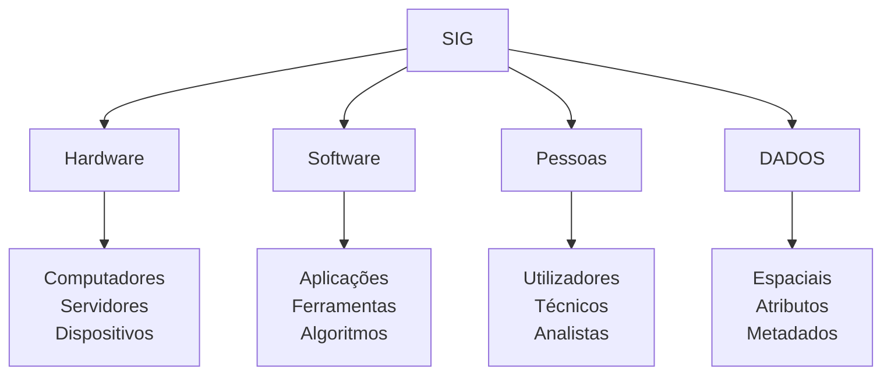
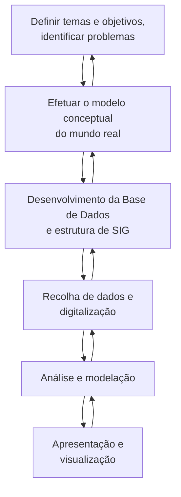
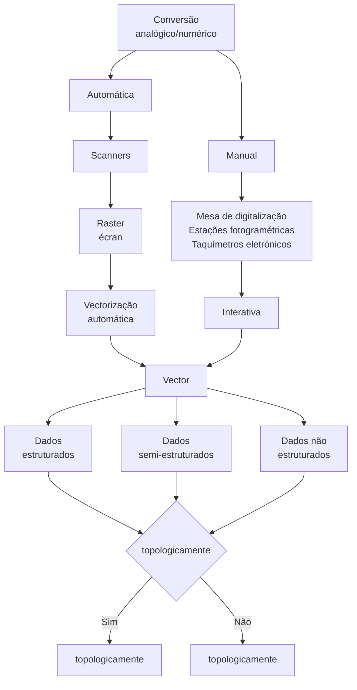

# Estudo de SIG

## Superfície Terrestre

A superfície física da Terra, com todas as suas irregularidades topográficas.

---

## Geóide

**Superfície de nível**, ou equipotencial, do campo gravítico terrestre, que corresponde à **posição média da superfície do mar prolongado sob os continentes** (e abstraindo da influência da Lua, do Sol, etc.).

### Geodesia

Elementos observados ou medidos são **reduzidos ao elipsóide de revolução**.

---

## Elipsóide de Revolução

**Superfície geométrica regular** que se assimila ao geóide, de forma a permitir um tratamento matemático mais simples.

Um elipsóide de revolução pode ser obtido pela **rotação de uma elipse em torno do seu eixo menor**.

**Exemplos:**

- Puissant
- Bessel
- Hayford
- **WGS84**

### Parâmetros do Elipsóide

#### Achatamento

$$f = \frac{a - b}{a}$$

#### Excentricidade

$$e^2 = \frac{a^2 - b^2}{a^2}$$

#### Relação entre e^2 e f

$$e^2 = 2f - f^2$$

---

## Carta

**Projeção sobre um plano horizontal**, a certa escala, do modelo geométrico que representa a superfície da Terra, satisfazendo as seguintes condições:

- A cada ponto no terreno, corresponde a **um ponto na carta**
- Sendo A e B pontos do terreno, existem na carta dois pontos a e b

$$\frac{ab}{AB} = E = \text{constante (escala)}$$

### Cartografia

**Representação do elipsóide num plano**, minimizando as deformações, combinando com a finalidade a que se destina.

---

## Projeção Cartográfica

**Aplicação definida matematicamente**, que a cada ponto do elipsóide faz corresponder um ponto do plano que constitui a carta.

### Projeção de Mercator

#### História e Características

A **projeção de Mercator** deve-se ao cartógrafo flamengo **Gerard Kremer** (1512-1594), chamado **Mercator**.

- **Publicada em 1569**
- É uma **projeção cilíndrica direta modificada**
- A **distância entre os paralelos** transformados **aumenta a partir do equador** para N e S na **mesma proporção** do aumento das distâncias entre os meridianos

#### Fórmulas da Projeção

$$X = R \cdot \Delta \lambda$$

$$Y = R \cdot \ln\left( \tan\left( \frac{\pi}{4} + \frac{\varphi}{2} \right) \right)$$

**Onde:**

- $R$ = raio da Terra
- $\Delta \lambda$ = diferença de longitude
- $\varphi$ = latitude

---

#### Importância para a Navegação

Até há pouco tempo, o emprego da **bússola** era o único meio prático de conhecer em cada instante a **direção do percurso** seguido, e a maneira mais simples de conduzir um barco de um ponto a outro da superfície terrestre.

É ainda hoje uma forma de **manter o rumo constante**.

#### Loxodromia

A **loxodromia** é uma linha que **corta todos os meridianos com um ângulo constante**.

É de **considerável importância para a navegação** uma carta com a propriedade de traçar as **loxodromias como linhas retas**.

**Características da Loxodromia:**

- **Rumo constante** - mantém sempre o mesmo ângulo com os meridianos
- Na **projeção de Mercator** aparece como uma **linha reta**
- **Facilita a navegação** pois permite manter um rumo fixo na bússola
- **Não é o caminho mais curto** entre dois pontos

#### Ortodromia

A **ortodromia** é o **caminho mais curto** entre dois pontos na superfície terrestre, correspondendo a um **arco de círculo máximo**.

**Características da Ortodromia:**

- Representa a **menor distância** entre dois pontos na esfera
- É um **arco de círculo máximo**
- Na **projeção de Mercator** aparece como uma **linha curva**
- O **rumo varia constantemente** ao longo do percurso
- **Mais eficiente** em termos de distância, mas **mais complexa** para navegação

**Diferenças Fundamentais:**

| **Loxodromia**                     | **Ortodromia**                         |
| ---------------------------------- | -------------------------------------- |
| Rumo constante                     | Rumo variável                          |
| Linha reta na projeção Mercator    | Linha curva na projeção Mercator       |
| Maior distância                    | Menor distância                        |
| Navegação simples                  | Navegação complexa                     |
| Prática para navegação tradicional | Ideal para aviação e navegação moderna |

#### Aplicações Práticas

- **Navegação marítima tradicional:** uso de loxodromias para facilidade de navegação
- **Aviação:** uso de ortodromias para otimizar combustível e tempo
- **GPS moderno:** cálculo automático de rotas ortodrómicas
- **Cartografia náutica:** cartas de Mercator ainda amplamente utilizadas

---

#### Características da Rede de Projeção

Na **projeção de Mercator**:

- O **equador** é desenvolvido segundo uma **reta**
- Os **meridianos** são representados por **retas equidistantes perpendiculares** a essa linha
- Os **paralelos** são **retas paralelas ao Equador**

#### Limitações Geográficas

Esta rede na prática **não permite representar as regiões polares** (latitudes superiores a **80º**).

A sua construção geométrica começa a ser muito **defeituosa a partir dos 45º de latitude**.

---

#### Vantagens

- É de **fácil construção**
- As **loxodromias são retas**
- Permite a **representação de quase toda a superfície terrestre**, embora as áreas cresçam muito rapidamente com as latitudes
- Permite a **junção perfeita de várias folhas**
- A **quadrícula é retangular** facilitando a medição de direções e a localização de pontos
- Como a carta é utilizada especialmente para **fins de navegação**, a grande distorção a altas latitudes **não tem grande importância** para o navegador

#### Inconvenientes

- **Agravamento da latitude** para Norte e Sul do Equador
- **Variação da escala** - sendo a escala das longitudes constante e a das latitudes variável
- **Paralelos todos iguais** dando origem a que os graus e minutos em longitude tenham sempre o mesmo comprimento, o que na realidade **não sucede**
- **Amplificações excessivas** para as regiões afastadas do Equador
- **Dificuldade de traçar levantamentos rádio** em virtude das ortodromias **não serem retas**

---

### Deformações em Projeções Cartográficas

Ao transferir a superfície **curva da Terra** para um **plano**, surgem inevitavelmente **deformações**. Nenhuma projeção consegue manter simultaneamente todas as propriedades geométricas da superfície original.

#### Tipos de Deformações

##### Deformação Linear

- Alteração das **distâncias** entre pontos
- A **escala varia** em diferentes direções e localizações na carta
- **Impossível manter** distâncias constantes em toda a projeção
- Fundamental para **cálculos de navegação** e **medições precisas**

##### Deformação Azimutal

- Alteração das **direções** (azimutes) entre pontos
- Os **ângulos de rumo** podem não corresponder à realidade
- Importante para **navegação** e **orientação**
- Pode afetar a **interpretação de direções** na carta

##### Deformação Angular

- Alteração dos **ângulos** formados entre linhas que se intersectam
- **Formas locais** podem ser distorcidas
- **Ângulos retos** podem não permanecer retos na projeção
- Crítica para **levantamentos topográficos** e **análise de formas**

##### Deformação Areal

- Alteração das **áreas** relativas entre diferentes regiões
- **Superfícies iguais** na Terra podem aparecer com tamanhos diferentes na carta
- Especialmente problemática nas **regiões polares** em projeções como Mercator
- Importante para **análises estatísticas** e **comparações geográficas**

#### Relação entre Deformações e Tipos de Projeção

- **Projeções Conformes:** minimizam deformação **angular** (preservam formas locais)
- **Projeções Equivalentes:** minimizam deformação **areal** (preservam áreas)
- **Projeções Equidistantes:** minimizam deformação **linear** em certas direções
- **Projeções Azimutais:** minimizam deformação **azimutal** a partir de pontos específicos

**Nota importante:** É **impossível eliminar simultaneamente** todos os tipos de deformação numa única projeção cartográfica.

---

### Classificação das Projeções

As projeções podem ser classificadas segundo: **a área**, **a forma**, **a escala**, **a direção**, **o método de construção**, entre outras características.

#### Quanto às Propriedades Conservadas

- **Equivalentes** - mantêm as **áreas**
- **Conformes** - mantêm a **forma**
- **Equidistantes** - mantêm a **escala**
- **Afiláticas** - **não conformes nem equivalentes**
- **Azimutais** - **azimutes são conservados** a partir de determinados pontos

#### Quanto à Superfície de Projeção

- **Superfície cilíndrica:** quando a superfície de projeção é um **cilindro**
- **Superfície cónica:** quando a superfície de projeção é um **cone**
- **Superfície azimutal ou plana:** quando a superfície de projeção é um **plano**

#### Quanto ao Tipo de Perspectiva

- **Centrográficas ou gnomónicas:** quando o **centro de perspectiva é o centro** do modelo
- **Estereográficas:** quando o **centro de perspectiva se situa sobre a superfície** do modelo
- **Ortográficas:** quando o **centro de perspectiva se situa no infinito**

#### Conceitos Fundamentais da Projeção

**"Projetar"** significa transferir features para uma **superfície adequada**, como um plano tangente, ou um cone secante. As **áreas próximas** destas superfícies são normalmente **melhor representadas**.

**Cones e cilindros** podem ser utilizados como superfícies intermédias, mas esta conversão **não anula a distorção** inerente às projeções.

#### Projeção Ideal

Uma projeção ideal deveria:

- Representar os **arcos de círculo máximo** como **segmentos de reta**
- **Comprimentos iguais** às correspondentes distâncias sobre o modelo reduzido da Terra
- Os **ângulos** de cada um desses segmentos com os diferentes meridianos deveriam ser **conservados**

#### Métodos de Construção

##### Cilíndricas

- **Mercator**
- **Transversa Mercator**

##### Cónicas

- **Conforme de Lambert**
- **Equivalente de Bonne**

##### Azimutais

- **Estereográfica Polar**

---

## DATUM

> **"Datum é um elipsóide devidamente posicionado"**

### Definição

- **O que é:** Datum = Elipsóide + "ponto de aplicação"
- **Como se define:** parâmetros de forma e de posição
- **Tipos de Datum:** globais, regionais e locais

**Exemplos:**

- **Datum Lisboa** (local)
- **Datum EUROPEU** (regional)
- **WGS84** (global)

### Estabelecimento de um Datum

#### Dados Necessários

- **Parâmetros de forma:** $a$, $b$, $f$, $e^2$

#### Procedimento

1. Considerar, no elipsóide tomado como referência, um **meridiano para origem das Longitudes**
2. Considerar um ponto em que as **coordenadas astronómicas coincidam com as geodésicas**:
   - $\Phi = \varphi$ e $\Lambda = \lambda$
3. Aplicar a **Normal sobre a Vertical do lugar**:
   - Vertical → Geóide
   - Normal → Elipsóide
   - **Desvio da Vertical = 0**
4. Rodar o elipsóide até que o **eixo da revolução fique paralelo** com o eixo de rotação do geóide (Terra)
5. **Elipsóide e geóide tangentes** num ponto → **Ondulação do Geóide (N) = 0**
6. **Correspondência ponto a ponto** entre a superfície natural da Terra (Geóide) e a superfície de referência (elipsóide)

---

### Tipos de Datum

#### Datum Planimétrico

**Objetivo:** Estabelecer um sistema de referência para coordenadas horizontais (latitude e longitude) através da definição da relação entre o elipsóide de referência e o geóide local.

**Conjunto de parâmetros** que definem a forma e o posicionamento do elipsóide relativamente ao geóide. Os parâmetros mais frequentemente utilizados são:

- O **semi-eixo maior** do elipsóide, $a$
- A **excentricidade**, elevada ao quadrado, $e^2$
- As **componentes do desvio da vertical** $\xi$ e $\eta$
- A **ondulação do geóide** no ponto de origem das coordenadas geodésicas, $N$

#### Datum Geodésico

**Objetivo:** Definir um sistema de referência tridimensional completo, estabelecendo tanto a forma quanto a posição do elipsóide de referência no espaço, permitindo a determinação precisa de coordenadas geodésicas.

**Conjunto de parâmetros** que definem a dimensão e a posição da superfície de referência: **2 relativas à forma e dimensão** do elipsóide, **6 relativas à posição**.

##### Datum Geocêntrico

Definido relativamente ao sistema terrestre médio por um **vetor de translação** e por **3 ângulos de rotação**:

- Parâmetros: $a$, $e^2$, $\Delta X$, $\Delta Y$, $\Delta Z$, $\omega_x$, $\omega_y$, $\omega_z$

##### Datum Topocêntrico

Definido por um **sistema astronómico local** no ponto origem e um **sistema geodésico local** fixo ao elipsóide:

- Parâmetros: $a$, $e^2$, $\varphi$, $\lambda$, $\eta$, $\xi$, N, $\delta\alpha$

##### Classificação por Abrangência

- **Datum Local:** ajusta-se melhor a uma **pequena região**
- **Datum Global:** o que **melhor se ajusta a todo o geóide**

#### Datum Altimétrico

**Objetivo:** Estabelecer uma superfície de referência única e consistente para a medição de altitudes, permitindo a comparação e integração de dados altimétricos de diferentes fontes e regiões.

**Superfície tomada para referência** na medição da coordenada altimétrica (cota, altitude) de cada ponto.

Em geral, a superfície considerada é o **geóide**, que se assimila ao **nível médio das águas do mar**; mas nalguns casos, consideram-se **cotas relativas ao elipsóide** (caso de dados GPS).

---

### Conceitos Relacionados

#### Desvio da Vertical

É um **ângulo** que faz o plano que contém a **vertical do lugar** com o plano da **Normal ao elipsóide** nesse ponto.

A **vertical do lugar** está associada ao **zénite astronómico**, enquanto a **normal ao elipsóide** está associada ao **zénite geodésico**.

#### Altitude Elipsóidica

A **altitude elipsóidica** ($h$) é a **distância medida ao longo da normal ao elipsóide** desde a superfície do elipsóide até ao ponto considerado.

**Características:**

- Medida segundo a **normal ao elipsóide**
- Superfície de referência: **elipsóide**
- Obtida diretamente por **GPS**
- **Não tem significado físico** direto relacionado com a gravidade

**Relação fundamental:**

$$h = H + N$$

**Onde:**

- $h$ = **altitude elipsóidica**
- $H$ = **altitude ortométrica** (cota)
- $N$ = **ondulação do geóide**

**Importante:** $N$ **pode ser positivo ou negativo**, dependendo se o geóide está acima ou abaixo do elipsóide no ponto considerado.

#### Ondulação do Geóide

A **ondulação do geóide** ($N$) representa a **diferença de altura** entre o geóide e o elipsóide num determinado ponto.

**Características:**

- $N > 0$: geóide **acima** do elipsóide
- $N < 0$: geóide **abaixo** do elipsóide  
- $N = 0$: geóide **tangente** ao elipsóide

É fundamental para a **conversão entre altitudes elipsóidicas** (GPS) e **altitudes ortométricas** (nivelamento).

---

### Equação de Laplace (Reduzida)

$$\alpha = A - (\Lambda - \lambda) \cdot \sin\varphi$$

**Onde:**

- $\alpha$ - azimute geodésico
- $A$ - azimute astronómico  
- $\lambda$ - longitude geodésica
- $\Lambda$ - longitude astronómica
- $\varphi$ - latitude geodésica

---

## Sistemas de Coordenadas e Referenciação

### Coordenadas Geográficas

#### Elementos Fundamentais

- **Meridiano:** É o **círculo máximo** que resulta da interseção da superfície terrestre por um plano passando pelo **centro da Terra**, **perpendicular à linha dos pólos**.

- **Equador:** É o **círculo máximo** que resulta da interseção da superfície terrestre por um plano passando pelo **centro da Terra**, **paralelo à linha dos pólos**.

- **Meridiano do lugar:** É o **meridiano que passa pelo ponto**

- **Paralelo do lugar:** É o **círculo menor**, paralelo ao Equador (cujo plano é paralelo ao do Equador) que **passa pelo ponto**.

#### Coordenadas

- **Latitude do lugar:** É o **arco do meridiano do lugar** compreendido entre o **Equador** e o **paralelo do lugar**, contando de **0° a 90°** para Norte (North) ou para Sul (South) do Equador.

- **Longitude do Lugar:** É o **arco do equador** (ou do Paralelo do Lugar) compreendido entre o **meridiano de referência** e o **meridiano do lugar**, contando de **0° a 180°** ou de **0h a 12h**, positivamente para E e negativamente para W, ou simplesmente com a designação Este ou Oeste (West).

- **Origem das Longitudes:** **Meridiano Greenwich** - ou W para esquerda, + ou E para direita.

#### Transformação de Coordenadas

$$(\varphi, \lambda, h) \longrightarrow (x, y)$$

$$X = f_1(\varphi, \lambda), \quad Y = f_2(\varphi, \lambda)$$

---

### Sistemas de Referenciação Espacial

**Referenciar** é relacionar objetos, posições, recorrendo-se a um **sistema de referência** que seja entendido por todos os que o utilizam.

Uma **projeção cartográfica** é um projeto para reproduzir, **num plano**, toda ou uma parte da **superfície terrestre**.

A sua escolha deve atender aos seguintes parâmetros: **extensão e configuração da área** a representar, **latitude média** da região, **fim a que se destina** a carta, etc.

#### Tipos de Sistemas de Referenciação

##### Sistemas Expeditos

**Características:**

- **Simples** e de **rápida aplicação**
- **Baixa precisão**
- Utilizados para **referenciação aproximada**
- **Exemplos:** referências locais, marcos visuais

##### Sistemas com Quadrícula

**Características:**

- **Alta precisão** e **rigor matemático**
- Baseados em **projeções cartográficas**
- **Coordenadas planares** (X, Y)
- **Exemplos:** UTM, Lambert, Gauss-Krüger

**Vantagens dos Sistemas com Quadrícula:**

- **Medições diretas** em unidades métricas
- **Cálculos simplificados** de distâncias e áreas
- **Compatibilidade** com sistemas de informação geográfica
- **Padronização** internacional

---

### Sistema UTM (Universal Transverse Mercator)

#### Características Fundamentais

- **Projeção:** Cilíndrica Transversa Mercator ou **Gauss-Krüger**
- **Divisão da Terra:** **60 fusos** de **6º de longitude** cada
- **Numeração dos fusos:** de **1 a 60** a partir do **antimeridiano de Greenwich**, de Oeste para Este
- **Divisão por paralelos:** cada fuso dividido por paralelos com **8º de latitude** a partir do Equador (**ZONA**)
- **Identificação das zonas:** por **1 letra** (exceto A, B, Y, Z, I, O)
- **Limitação geográfica:** entre os paralelos **84º N** e **80º S**

#### Estrutura do Sistema de Referência

- Cada **fuso** tem um **sistema de referência próprio** com **origem fictícia**
- Em cada **zona** é criada uma **malha regular** de **100 km** de lado
- Cada **quadrado 100 x 100 km** é identificado por **2 letras**
- Cada quadrado **100 x 100 km** subdivide-se em outros de **10 x 10 km**
- Estes, por sua vez, subdividem-se em quadrados de **1 x 1 km** (quadrícula representada na folha **1:25.000**)

---

#### Sistema UPS (Universal Polar Stereographic)

##### Aplicação

Para as **áreas não abrangidas** pela quadrícula UTM:

- **Calote Norte:** latitudes superiores a **84ºN**
- **Calote Sul:** latitudes superiores a **80ºS**

##### Características

Consiste num **sistema de quadrados**, baseados numa **medida linear em metros**, a partir de um **ponto origem**, que se usa para a **localização ou referenciação de pontos**, análoga à usada na UTM.

O **sistema de referenciação** da quadrícula militar usa-se também com a **quadrícula UPS**, identificada **só por letras**.

##### Identificação das Zonas

- **Calote Sul:** letras **A e B** para identificar as zonas **Oeste e Este**
- **Calote Norte:** letras **Y e Z** para identificar as zonas **Oeste e Este**

---

#### Vantagens e Aplicações

##### Conclusões

1. Com as **projeções UTM e UPS** é possível resolver o problema de uma **cartografia universal** em **representação conforme**
2. **Importante** em cartas destinadas a determinados usos para que os **ângulos nelas medidos** se não afastem dos valores que lhes correspondem à **superfície da Terra**
3. Nestas condições, as **formas das figuras** à superfície da Terra **pouco se afastam** das formas que apresentam na **representação plana**, desde que não se considerem **regiões de grandes dimensões**, pois, neste caso, surgem como é natural **grandes distorções**
4. Por este motivo, as **representações UTM e UPS** não devem ser empregues em **cartas de pequena escala**, utilizando-se apenas em cartas de escala **superior a 1/500.000**

#### Resumo das Aplicações

| **Sistema**   | **Área de Cobertura** | **Escala Recomendada** | **Tipo de Projeção** |
| ------------- | --------------------- | ---------------------- | -------------------- |
| **UTM**       | 84°N a 80°S           | > 1:500.000            | Transversa Mercator  |
| **UPS Norte** | > 84°N                | > 1:500.000            | Estereográfica Polar |
| **UPS Sul**   | > 80°S                | > 1:500.000            | Estereográfica Polar |

## SIG - Sistemas de Informação Geográfica

### Definições de SIG

**Diferentes Perspetivas:**

- **Lanter:** "Conjunto de funções para tornar explícitos os elementos/entidades espaciais que estão definidos com relações espaciais implícitas"
- **Goodchild:** "É uma base de dados espaciais que proporciona soluções para pesquisa de natureza geográfica"
- **Clarke:** "É um sistema (computacional) para a recolha, armazenamento, pesquisa, análise e saída de dados geográficos"

#### Aspetos Fundamentais de um SIG

Uma definição de SIG deve ter em consideração os seguintes aspetos:

- A **tecnologia SIG** (hardware e software)
- A **base de dados SIG** (dados geográficos e outros com eles relacionados)
- A **infraestrutura SIG** (pessoal, instalações e outros elementos de apoio)

---

### Conceito Integrado

**Sistema de Informação Geográfica** é um **sistema computorizado** capaz de **adquirir, armazenar, manipular e analisar** todos os dados passíveis de serem **georreferenciados** (Informação Geográfica), com possibilidade de **integrar dados espaciais** com outro tipo de dados.

#### Componentes Chave

Um SIG integra **quatro componentes chave**:

---

### Capacidades de um SIG

Independentemente do software SIG utilizado, um SIG deve ter capacidade de responder a **cinco questões primárias**:

#### As 5 Questões Fundamentais

1. **Localização** - A posição geográfica ocupada por uma feature específica

2. **Condição** - Os atributos dessa posição geográfica

3. **Tendência** - Variação temporal de determinado fenómeno

4. **Padrões** - Visualização de dados

5. **Modelação** - Testar diferentes cenários para um determinado problema de modo a prever fenómenos futuros

**Além disso:** Relacionar espacialmente os diferentes objetos representados (**adjacência, proximidade, conectividade**).

---

### Formas de Utilização de um SIG

**Segundo Câmara (1995):**

- Como **ferramenta para produção de mapas**
- Como **suporte para análise espacial** de fenómenos
- Como uma **base de dados geográficos**, com funções de armazenamento e utilização de informação espacial

#### Fluxograma de Atividades de um SIG

---

### Base de Dados Geográfica

A **base de dados geográfica** é o componente do SIG responsável por **armazenar os objetos geográficos** e campos necessários a uma aplicação.

#### Tipos de Dados

| **Mundo Real** | **Representação Digital** |
| -------------- | ------------------------- |
| Customers      | Pontos de interesse       |
| Streets        | Linhas/Redes              |
| Parcels        | Polígonos                 |
| Elevation      | Superfícies               |
| Land usage     | Áreas temáticas           |

---

### Modelos de Dados Espaciais

#### Dados Raster vs Vectoriais

**Dados Raster:**

- Podem ser adquiridos por **rasterização** de documentos em formato analógico
- Obtidos diretamente no **formato digital raster** (fotografia aérea, imagem de satélite...)
- Estrutura de **matriz de células** (pixels)

**Dados Vectoriais:**

- Constituídos por **pontos, linhas e polígonos**
- Armazenam a **referenciação geográfica** (x, y)
- **Precisão geométrica** elevada

#### Ortofoto

**Definição:** Combina as **propriedades visuais** de uma fotografia com a **exatidão posicional** de um mapa.

**Características:**

- **Correção geométrica** aplicada
- **Referenciação espacial** precisa
- **Base cartográfica** de alta qualidade

---

### Operações sobre os Dados: Geoprocessamento

#### Principais Operações

**Extração de Dados:**

- Cria um **subconjunto de entidades** a partir de um conjunto de dados baseado no **limite de uma entidade**

**Sobreposição:**

- **Combina dois ou mais conjuntos** de dados para criar um **novo conjunto de dados**

**Proximidade:**

- Procura **áreas próximas** de entidades

#### Relações Topológicas

**Topologia** é definida como "**relações espaciais** entre entidades espaciais **adjacentes ou vizinhas**."

**Exemplos de Relações:**

- **Adjacência** - entidades que partilham fronteiras
- **Contenção** - entidades dentro de outras
- **Sobreposição** - entidades que se intersectam
- **Conectividade** - entidades ligadas através de redes

---

### Layers (Camadas)

A **Informação Geográfica** é visualizada sobre o mapa como "**Layers**".

#### Características dos Layers

- Um Layer representa um **tipo particular de features** (edifícios, hidrografia, estradas, limites administrativos...)
- Um Layer **não arquiva os dados geográficos** mas sim as **ligações aos dados** contidos em:
  - Geodatabases
  - Grids
  - Imagens
  - Shapefiles
  - Coverages

#### Conteúdo dos Layers

Os layers contêm a informação relativa a:

- **Legenda**
- **Visualização** do tema respetivo
- **Escala de trabalho**
- **Definição das queries**
- **Joins** (ligações entre tabelas)

---

### Ferramentas Interativas

**Ferramentas para "explorar" e selecionar dados:**

- **Map tips** ("primary label name")
- **Magnification window** (janela de ampliação)
- **Overview window** (janela de visão geral)
- **Spatial bookmarks** (marcadores espaciais)

**Vantagens:**

- **Navegação intuitiva**
- **Identificação rápida** de elementos
- **Controlo da visualização**
- **Acesso direto** a áreas de interesse

---

### Integração e Relacionamento de Dados

**Característica fundamental:** Num SIG, qualquer **feature "contendo" dados** pode ser **relacionada a fontes externas**.

**Benefícios:**

- **Enriquecimento** da informação espacial
- **Análises multitemáticas**
- **Cruzamento** de dados diversos
- **Visão holística** dos fenómenos

---

### Conclusões

1. **Ferramenta Imprescindível:** As tecnologias SIG são ferramentas **imprescindíveis** na gestão de informação georreferenciada
2. **Apoio à Decisão:** Os SIG dão ao decisor a **visão do terreno e dos fenómenos**, permitindo uma **decisão ponderada**
3. **Integração de Dados:** A possibilidade de **integrar dados geográficos** com dados de outras fontes permite o **cruzamento de dados** que de outras formas se torna complexo
4. **Produção Cartográfica:** Os SIG associados às **BDG** (Bases de Dados Geográficas) são **ferramentas poderosas** na produção de cartografia e **gestão da informação geográfica**

#### Impacto dos SIG

**Áreas de Aplicação:**

- **Planeamento urbano** e territorial
- **Gestão ambiental**
- **Análise de mercado**
- **Segurança pública**
- **Agricultura de precisão**
- **Gestão de recursos naturais**
- **Análise de riscos**
- **Transportes e logística**

## Rasterização

### Aquisição de Dados para um SIG

#### Processo Geral

- **Planeamento e organização**
- **Aquisição dos dados** (processo de digitalização)
- **Rasterização**
- **Georreferenciação**

#### Aquisição de Dados: Imagem

1. **Pré-processamento** / Remoção de ruído
2. **Melhoramento da imagem** / Contraste e brilho
3. **Análise temática** / Criação de temas
4. **Classificação** / Temas/Categorias
5. **Integração num SIG**

---

### Conceitos Fundamentais da Rasterização

Em cartografia, os dados sob a forma numérica podem ser adquiridos de **duas formas**:

1. Os dados são **adquiridos já sob a forma digital** (ex: imagens de satélite)
2. **Transformação da informação analógica** correspondente a cartas, imagens, etc. em informação numérica, recorrendo a **conversores analógico-numéricos** (scanners)

#### Definições

**Rasterização:** Conversão **automática** de informação de modo **analógico** para o modo **numérico**.

**Scanners:** Sistemas **automáticos de varrimento**, que consistem numa **discretização** em elementos imagem individuais (**PIXEL** - picture element) e numa **quantificação** de cada um desses elementos com **valores de cinzento** resultante de uma tabela previamente definida.

---

### Teorema da Digitalização

Para que o **conteúdo da informação geométrica** de uma imagem analógica seja transformado, **sem prejuízo**, numa imagem digital, a **frequência de digitalização** deve ser, no mínimo, o **dobro da mais alta frequência** do sinal da imagem analógica.

$$A_{NY} \leq \frac{1}{2 \cdot f}$$

**Onde:**

- $A_{NY}$ = frequência de digitalização necessária (dimensão do pixel)
- $f$ = frequência de sinal mais alta que aparece na imagem analógica

À **frequência limite** $2f$, chama-se **frequência de Nyquist**.

#### Parâmetros Técnicos

- **Largura mínima do traço** a ser rasterizado é normalmente em mapas (formato papel) de **0,1 mm**
- Por definição, uma **linha** é constituída por um **traço escuro** e um **traço claro adjacente**. Por isso esta unidade é normalmente designada por **par de linhas [lp]**
- O **número de pares de linhas [lp]** por 1 mm é a **frequência do sinal** do desenho de traço
- Existe assim uma **relação de compromisso** entre a capacidade de memória, as dimensões da imagem e a dimensão do pixel (frequência de digitalização)

#### Tipos de Rasterização

**Superrasterização:** A frequência de digitalização é **maior** do que a **frequência limite 2f** do sinal.

**Subrasterização:** A frequência de digitalização é **menor** do que a **frequência limite 2f** do sinal. O que leva a uma **perda de informação**.

---

### Tipos de Resolução

#### Resolução Geométrica

Está relacionada com as **dimensões da janela de rasterização**, ou seja, de acordo com o **tamanho do pixel**.

A resolução mede-se em **μm** (microns) ou **dpi** (dots per inch).

$$\text{dpi } (1~\text{inch} = 2{,}54~\text{cm}) \Rightarrow 1~\mu\text{m} = 10^{-6}~\text{m}$$

**Características:**

- Determina o **nível de detalhe espacial** da imagem
- **Menor pixel** = **maior resolução geométrica**
- Fundamental para **análises de precisão**

#### Resolução Radiométrica

Está relacionada com o **conversor analógico/numérico**, ou seja, com o **número de níveis de cinzento** que se obtêm entre o preto e branco.

$$1 \text{ byte} = 8 \text{ bits} = 2^8 = 256 \text{ níveis } (0-255)$$

**Características:**

- Determina a **capacidade** que o sensor tem em **distinguir objetos** com índices de reflexão similares
- **Maior resolução radiométrica** = **melhor distinção** dos objetos espaciais
- É uma das **importantes características** dos dados obtidos por deteção remota

---

### Exemplos Práticos

#### Diferentes Resoluções Radiométricas

| **Baixa Resolução Radiométrica** | **Alta Resolução Radiométrica** |
| -------------------------------- | ------------------------------- |
| Poucos níveis de cinzento        | Muitos níveis de cinzento       |
| Menor capacidade de distinção    | Maior capacidade de distinção   |
| Menos informação disponível      | Mais informação disponível      |

#### Diferentes Resoluções Geométricas

---

### Conversão Analógico-Numérico

O processo de **conversão analógico-numérico** pode ser realizado através de diferentes métodos, cada um adequado a tipos específicos de dados e objetivos.

#### Características dos Métodos

| **Método**     | **Vantagens**       | **Desvantagens**         | **Aplicações**         |
| -------------- | ------------------- | ------------------------ | ---------------------- |
| **Automático** | Rápido, consistente | Requer pós-processamento | Mapas simples, imagens |
| **Manual**     | Precisão, controlo  | Lento, subjetivo         | Mapas complexos, CAD   |

#### Tipos de Dados Resultantes

**Dados Estruturados:**

- **Organização topológica** completa
- **Relações espaciais** definidas
- Adequados para **análises complexas**

**Dados Semi-estruturados:**

- **Organização parcial**
- Algumas **relações topológicas**
- Requerem **processamento adicional**

**Dados Não Estruturados:**

- **Sem organização topológica**
- **Elementos isolados**
- Limitados para **análises espaciais**

---

### Georreferenciação

#### Transformação entre Sistemas de Coordenadas

No **sistema de coordenadas imagem**, a origem está definida no **canto superior esquerdo** da mesma. Uma célula é espacialmente localizada de acordo com os seus **números de linha e de coluna**, contados a partir da origem. No **sistema de coordenadas terreno**, a origem é definida no **canto inferior esquerdo** do referencial (0,0).

#### Conceito de Georreferenciação

O objetivo da **georreferenciação** é **corrigir geometricamente** uma imagem, **associando-a** a um dado sistema de coordenadas.

Nesta **correção geométrica** pretende-se que os **valores de cinzento dos pixels fiquem inalterados**, alterando a sua **posição espacial**.

#### Etapas do Processo

Este processo pode ser dividido em **5 etapas**:

1. **Escolha da equação de transformação**
2. **Medição de pontos idênticos**
3. **Escolha do algoritmo de rectificação**
4. **Escolha da interpolação de valores de cinzento** (resampling)
5. **Controlo de qualidade**

---

### Equações de Transformação

#### a) Transformação de HELMERT

É uma **transformação de semelhança**, envolve **2 translações, uma rotação e um fator de escala**.

$$\begin{cases}
X = a_0 + a_1 X' - a_2 Y' \\
Y = b_0 + a_2 X' + a_1 Y'
\end{cases}$$

#### b) Transformação AFIM

Esta transformação introduz **escalas diferentes em X e Y**. Envolve **2 translações, 2 rotações e 2 fatores de escala**.

$$\begin{cases}
X = a_0 + a_1 X' + a_2 Y' \\
Y = b_0 + b_1 X' + b_2 Y'
\end{cases}$$

#### c) Polinómios de grau n

$$\begin{cases}
X = a_0 + a_1 X' + a_2 Y' + a_3 {X'}^2 + a_4 {Y'}^2 + a_5 X' Y' \\
Y = b_0 + b_1 X' + b_2 Y' + b_3 {X'}^2 + b_4 {Y'}^2 + b_5 X' Y'
\end{cases}$$

---

### Rectificação

**1 - Rectificação direta**

**2 - Rectificação indireta**

---

### Interpolação para os Valores de Cinzento (Resampling)

**Métodos disponíveis:**

1. **Interpolação da proximidade imediata** (Nearest Neighbor)
2. **Interpolação bilinear**
3. **Interpolação bicúbica de spline**
4. **Interpolação com polinómios de Lagrange**

---

#### Resampling: Nearest Neighbor

Usa o **valor da célula**, da imagem de input, **mais próxima** da célula da imagem de output.

**Vantagens:**
- Os **valores dos pixels de saída** são os **mesmos** que os dos pixels originais
- Outros métodos de resampling tendem a usar **médias** dos valores dos pixels vizinhos, o que **não acontece** com este método. Este fator pode ser importante na **discriminação de tipos de vegetação** ou na **definição de limites de fronteira**
- Como os **dados originais são mantidos**, recomenda-se efetuar este método **antes da classificação** da Imagem
- **Fácil de calcular**

**Desvantagens:**
- Produz na imagem de saída um **efeito tipo "escada"**
- A imagem de saída tem uma aparência mais **"rugosa"** do que a imagem não rectificada
- Existem **valores da imagem** que podem ser **perdidos**, enquanto outros podem ser **duplicados**

---

#### Resampling: Interpolação Bilinear

A interpolação bilinear usa a **média pesada dos 4 pixels**, da imagem de entrada, **mais próximos** do pixel da imagem de saída.

**Vantagens:**
- O **efeito de "escada" é reduzido**. A imagem aparece **mais suavizada**

**Desvantagens:**
- **Altera o valor original** dos dados e **reduz o contraste** por utilizar médias
- É **computacionalmente mais complicado** do que o método anterior

---

#### Resampling: Convolução Cúbica

A convolução cúbica usa uma **média pesada dos 16 pixels** mais próximos do pixel em causa. O output é similar ao da interpolação bilinear, mas a **suavização da imagem é maior**.

**Vantagens:**
- O **efeito de "escada" é reduzido**. A imagem aparece **mais suavizada**

**Desvantagens:**
- **Altera os valores originais** dos pixels e **reduz o contraste** da imagem
- É **computacionalmente mais dispendioso** que os dois métodos anteriores

---

### Resumo dos Métodos de Resampling

| **Método**                 | **Pixels Utilizados** | **Descrição**                                                                                          |
| -------------------------- | --------------------- | ------------------------------------------------------------------------------------------------------ |
| **Nearest Neighbor**       | 1                     | Usa o valor do pixel mais próximo                                                                      |
| **Bilinear Interpolation** | 4 (array 2×2)         | Calcula o valor do pixel de output através da média pesada dos 4 pixels vizinhos baseado na distância  |
| **Cubic Convolution**      | 16 (array 4×4)        | Calcula o valor do pixel de output através da média pesada dos 16 pixels vizinhos baseado na distância |

---

## Transformação de Coordenadas entre Sistemas Geodésicos

### Introdução

A **transformação de coordenadas** entre diferentes sistemas geodésicos é fundamental quando se trabalha com dados provenientes de **diferentes fontes** ou quando se necessita de **integrar informação** referenciada a **datums distintos**.

### Necessidade de Transformação

#### Situações Comuns

- **Integração de dados** de diferentes épocas ou projetos
- **Migração** para novos sistemas de referência (ex: de Datum 73 para ETRS89)
- **Compatibilização** de dados GPS (WGS84) com cartografia nacional
- **Projetos internacionais** que envolvem múltiplos sistemas de referência
- **Análises** que requerem dados homogéneos num único sistema

---

## Fórmulas de Bursa-Wolf

### Definição

As **Fórmulas de Bursa-Wolf** (também conhecidas como **transformação de 7 parâmetros**) são utilizadas para a **transformação rigorosa** entre dois sistemas geodésicos tridimensionais.

### Fórmula Matemática

$$\begin{bmatrix}
X_2 \\
Y_2 \\
Z_2
\end{bmatrix} = \begin{bmatrix}
\Delta X \\
\Delta Y \\
\Delta Z
\end{bmatrix} + (1 + \Delta S) \begin{bmatrix}
1 & -\omega_z & \omega_y \\
\omega_z & 1 & -\omega_x \\
-\omega_y & \omega_x & 1
\end{bmatrix} \begin{bmatrix}
X_1 \\
Y_1 \\
Z_1
\end{bmatrix}$$

### Os 7 Parâmetros de Transformação

#### Parâmetros de Translação
- **ΔX, ΔY, ΔZ** - translações nos três eixos coordenados (em metros)

#### Parâmetros de Rotação
- **ωx, ωy, ωz** - rotações em torno dos três eixos (em segundos de arco)

#### Parâmetro de Escala
- **ΔS** - fator de escala (adimensional, geralmente expresso em ppm - partes por milhão)

### Quando e Como Utilizar

#### Situações de Aplicação

**✅ Use Bursa-Wolf quando:**
- **Diferenças significativas** entre os datums (> 100 metros)
- **Transformações intercontinentais** (ex: datum local → WGS84)
- **Precisão elevada** é requerida
- **Dados disponíveis** dos 7 parâmetros de transformação
- **Transformações oficiais** entre sistemas de referência nacionais

#### Exemplos Práticos

**Transformação Datum 73 → ETRS89 (Portugal):**
- ΔX = -239.749 m
- ΔY = -88.181 m  
- ΔZ = -218.088 m
- ωx = -0.285"
- ωy = -0.515"
- ωz = -2.995"
- ΔS = -5.197 ppm

#### Vantagens
- **Precisão máxima** (erros submétricos)
- **Rigor matemático** completo
- **Padronização internacional**
- **Reversibilidade** da transformação

#### Limitações
- **Complexidade** de cálculo
- **Necessidade** dos 7 parâmetros oficiais
- **Coordenadas cartesianas** (X,Y,Z) como input

---

## Fórmulas de Molodensky

### Definição

As **Fórmulas de Molodensky** são utilizadas para **transformações aproximadas** entre sistemas geodésicos quando as **diferenças de parâmetros** entre os dois datums são **suficientemente pequenas**.

### Características Fundamentais

- **Transformação direta** em coordenadas geodésicas (φ, λ, h)
- **Aproximação de primeira ordem**
- **Simplicidade** de cálculo
- **Precisão adequada** para pequenas diferenças entre datums

### Fórmulas Matemáticas

#### Fórmula de Molodensky Padrão

$$\Delta \varphi = \frac{1}{\rho} \left[ \frac{\Delta a}{N} \sin \varphi \cos \varphi + \Delta f \left( \frac{M}{N} + \frac{N}{M} \right) \sin \varphi \cos \varphi + \Delta \varphi_0 \right]$$

$$\Delta \lambda = \frac{1}{\rho \cos \varphi} \Delta \lambda_0$$

$$\Delta h = \Delta a \frac{\sin^2 \varphi}{N} + \Delta f \frac{N \sin^2 \varphi}{a} + \Delta h_0$$

#### Fórmula Simplificada

Para **pequenas diferenças entre datums:**

$$\Delta \varphi \approx \frac{\Delta a}{N \rho} \sin \varphi \cos \varphi$$

$$\Delta \lambda \approx \frac{\Delta \lambda_0}{\rho \cos \varphi}$$

$$\Delta h \approx \Delta a \frac{\sin^2 \varphi}{N}$$

### Parâmetros Necessários

- **Δa** - diferença entre semi-eixos maiores
- **Δf** - diferença entre achatamentos
- **Δφ₀, Δλ₀, Δh₀** - correções de origem
- **M, N** - raios de curvatura dos meridianos e primeiro vertical

### Quando e Como Utilizar

#### Critérios de Aplicação

**✅ Use Molodensky quando:**
- **Diferenças pequenas** entre datums (< 50-100 metros)
- **Transformações regionais** com datums similares
- **Cálculo rápido** é prioritário
- **Precisão métrica** é suficiente
- **Coordenadas geodésicas** são o formato de trabalho

#### Condições Ideais

**"Diferenças suficientemente pequenas"** significa:
- **|Δa| < 100 m** (diferença entre semi-eixos maiores)
- **|Δf| < 50 × 10⁻⁶** (diferença entre achatamentos)
- **Translações < 100 m** entre origens dos datums

#### Exemplos de Aplicação

**Transformações regionais adequadas:**
- Entre datums europeus próximos
- Datum nacional → datum regional
- Ajustes locais de coordenadas
- Correções de pequena escala

#### Vantagens
- **Simplicidade** de implementação
- **Cálculo direto** em coordenadas geodésicas
- **Velocidade** de processamento
- **Menor complexidade** matemática

#### Limitações
- **Precisão limitada** (erros métricos)
- **Apenas para pequenas diferenças** entre datums
- **Aproximação** matemática
- **Não reversível** com a mesma precisão

---

### Comparação Entre os Métodos

| **Aspeto**          | **Bursa-Wolf**          | **Molodensky**         |
| ------------------- | ----------------------- | ---------------------- |
| **Precisão**        | Submétrica              | Métrica                |
| **Complexidade**    | Alta                    | Baixa                  |
| **Aplicação**       | Diferenças grandes      | Diferenças pequenas    |
| **Parâmetros**      | 7 parâmetros            | 3-5 parâmetros         |
| **Input**           | Coordenadas cartesianas | Coordenadas geodésicas |
| **Reversibilidade** | Rigorosa                | Aproximada             |
| **Velocidade**      | Mais lenta              | Mais rápida            |

### Critérios de Escolha

#### Use **Bursa-Wolf** quando:
- **Precisão elevada** é crítica
- **Diferenças significativas** entre datums
- **Transformação oficial** é requerida
- **Dados dos 7 parâmetros** estão disponíveis

#### Use **Molodensky** quando:
- **Rapidez** é prioritária
- **Diferenças pequenas** entre datums
- **Precisão métrica** é suficiente
- **Simplificação** de processamento é desejada

---
